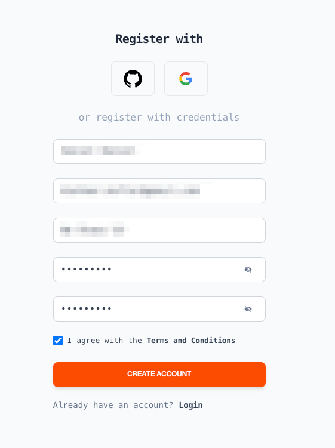

# Quick Start - How to get started

#### How to Sign up

Navigate to `app.riddleandcode.com`

<figure><figcaption>
Create a new account
</figcaption></figure>

#### Register your account&#x20;

<figure><figcaption>
Enter your credentials 
</figcaption></figure>

#### Verify Account

Once you created the account you will be asked to verify your account with a separate message via e-mail.&#x20;


Please follow the `Click here to verify your account`Link and comlete the verification process


<figure><figcaption>
Verify your account by following the link
</figcaption></figure>

#### How to Log In&#x20;

When your account has been verified you can login with your credentials

<figure><figcaption>
Navigate to the Login Button 
</figcaption></figure>

<figure><figcaption>
Log in with your credentials 
</figcaption></figure>

#### Dashboard&#x20;

After completing the login process navigate to `Dashboard` to access the available real time data of you and your community&#x20;

<figure><figcaption></figcaption></figure>

<figure><figcaption></figcaption></figure>

#### Edit Profile&#x20;

Navigate to the `Profile` page&#x20;

<figure><figcaption>
Navigate to Profile in the sidebar
</figcaption></figure>

<figure><figcaption></figcaption></figure>

#### Track your energy use&#x20;

Review the current available energy flows and the recommendations to `increase` or `reduce` the current energy consumption to improve the level of own usage of available renewable energy.&#x20;

<figure><figcaption></figcaption></figure>

<figure><figcaption></figcaption></figure>

