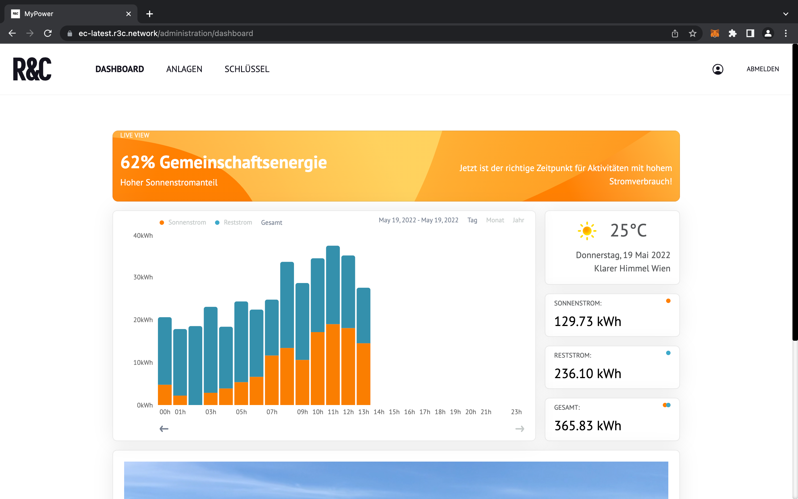

# Energy Flows

The energy flows are calculated based on the measurements of the devices which are added to the system. As users are associated with a single consumption unit. The energy flows represent, how much of the energy consumption of a user is coming from the production of devices and how much from the grid.

The energy flow calculation is based on a 15 minutes interval. If there is an overproduction happening within 15 minutes, this energy is considered to be transferred to the grid.

The energy is distributed to the members using the dynamic distribution algorithm also used by Austrian distribution system operators (such as the Wiener Netze).

`1ecu_consumption_green = (ecu_consumption / totat_consumption) * es_production`

ecu\_consumption\_green ... Consumption of an energy consumption unit from the energy sources in the community&#x20;

totat\_consumption ... Sum of all consumption units in the energy community es\_production ... Production of an energy sourceA consumption unit has a total consumption which consists of the following:

`1ecu_total_consumpition = ecu_consumption_green + ecu_consumption_grid`

ecu\_total\_consumpition ... Total consumption of an consumption unit&#x20;

ecu\_consumption\_green ... Consumption coming from an energy source within the community

ecu\_consumption\_grid ... Consumption coming from the gridThe energy flows are calculated per user and for the community as a whole.

**Energy Flows per member**

A member of the community can view its individual consumption and where this energy is coming from. In a convenient graph different time intervals can be used. A member can choose between a _daily_, _monthly_ or _yearly_ view. On the right side of the graph the total consumption with in an interval is shown, and also how much of this energy was coming from the grid and how much from the energy sources within the community. A live view on the top indicates where the energy to cover the current consumption, last 15 minutes, is coming from and to provide recommendations about using the community energy most efficiently.

**Community Balance**

Similar to the member dashboard, an operator can use its dashboard to see the energy flow on a community level.

<figure><figcaption></figcaption></figure>
